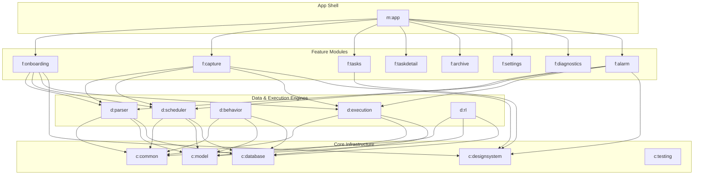
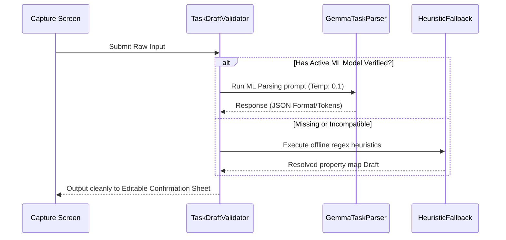

# 🏛️ ORKA Architecture

**Deep Design, Engineering Principles, & Integration Maps**

*This document explains the internal engineering blueprint, data flow, memory architecture, scheduling pipelines, and testing apparatus running ORKA.*

---

## 🧩 1. Module Layout & Gradle Architecture

ORKA leverages a strict, feature-based multi-module Gradle layout to ensure rigid isolation of concerns, highly concurrent Gradle execution, and completely decoupled UI. Compilation dependencies flow downward only. 

> **Note:** All modules strictly enforce Unidirectional Data Flow (UDF) via the MVVM pattern (`ViewModel` + `StateFlow`). Domain layers are totally sealed, communicating via suspendable `Flow` mappings with zero direct data-layer classes leaking into UI blocks.

---

## 💾 2. Persistence & Storage Strategy

ORKA requires maximum resilience due to its nature as a mission-critical alert system.

- **Relational Data Context (Room)**: Uses a secure, credential-encrypted database (`com.orka.core.database`) natively built with Kotlin KSP. Handles the entire entity graph modeling for Active Tasks, Snoozed Reminders, and extensive historical Behavioral logging. 
- **Key-Value Config (DataStore)**: Fast, type-safe settings mapped via `Preferences` DataStore intended for Onboarding gates, Feature Flags, Diagnostics metadata, and LLM Model Installation schemas.
- **Reboot Resilience Registry**: A tiny cache proxy of raw `AlarmManager` intents sits stored in Device-Protected Storage. This ensures execution intents are safely and silently rehydrated immediately matching unprompted OS-level device reboots without waiting for user unlock.

---

## 🧠 3. Model Lifecycle & The On-Device AI Pipeline

ORKA acts as a localized agent utilizing `MediaPipe LLM Inference` specifically targeted for a **Gemma-2B INT4** quantization. Operations occur exclusively offline.

### Model Bootstrapping & Validation
1. **Side-Load Verification**: Because of Google Play/APK limitations passing 1GB+, the asset `.bin` is sideloaded. The file is mapped and strictly checked against a canonical `SHA-256` integrity array upon user import.
2. **App-Managed Scoping**: Asset models get safely cached into app-managed external storage perimeters where it's unreachable without correct permissions.
3. **Graceful Degradation Design**: If the user lacks storage space, operates an incompatible sub-tier device compute context, or skips AI import, `TaskParser` will automatically decouple to an exact lexical parsing routine natively bundled called `RuleBasedParserImpl`. 

### Logic Parsing Run-Book

---

## ⏱️ 4. Scheduler Engine & Progressive Policies

One rigid abstract interface `SchedulerPolicy` handles algorithm iteration over time. Telemetry dictates standard operations.

- **Phase 1: Rule-Based Scheduling** (Baseline)
  It outputs pure static timelines derived mathematically working backward against the `task.deadline`.
- **Phase 2: Adaptive Scheduling** (Telemetry Dependent)
  Unlocked autonomously when `BehaviorProfileRepository` captures adequate interaction sample sizing. Dynamically pivots alarm triggers mapping strictly inside the calculated "high-productivity temporal window" learned locally.
- **Phase 3: Reinforcement Learning (RL)** (Experimental Layer)
  Functions across `RlTrainer` executed entirely asynchronously utilizing `WorkManager` constraints against Idle+Charging windows only. Penalizes ignore heuristics while rewarding successfully executed behaviors mathematically adjusting model hyper-parameters over thousands of interactions.

---

## 🔔 5. Alarm Delivery & Intent Path 

ORKA utilizes deep system overrides. This is explicitly **not a background push notification system**.

1. **Broadcast Execution**: Trigger constraints utilize `AlarmManager.setAlarmClock()` (API 31+) triggering hard-mapped `BroadcastReceiver` configurations.
2. **Permission Matrices**: Handled directly in the Onboarding Module requiring absolute adherence requesting both `SCHEDULE_EXACT_ALARM` as well as disabling Android OEM Battery Optimizations natively.
3. **System Interpolation**: `AlarmActionResolver` fires synchronously on the intent arriving, mapping real-time local variables (e.g., proximity to deadline timestamp) dynamically resolving whether an action like `SNOOZE_SHORT` or `ACKNOWLEDGE` is legally available, pushing exactly 2 to 4 actions down into an un-dismissible Compose screen rendering on-top of all locks.

---

## 🧪 6. Testing Harness & Continuous Quality

`core:testing` supplies a vast fake-first harness constructed over JUnit4 + Truth + Coroutines Turbine execution. 

- **Stub Avoidance Methodology**: Heavy implementation of `FakeBehaviorProfileRepository`, `FakeTaskParser`, and exact test fixtures.
- **Rigid Determinism**: `MainDispatcherRule` prevents async-related race conditions across Coroutine `runBlockingTest` contexts. Everything from model timeouts to parser string mismatch errors maps cleanly in 100% CI coverage scope.
- **Performance Profiling Constraints**: 
  - **Baseline Profiles**: Built-in logic statically mapping critical hot-paths directly stopping runtime AOT stutter on fresh Cold-Starts + LLM context warming.
  - **Macrobenchmark Suites**: Automates scrolling and navigation lag execution logic natively validating performance rendering inside connected testbeds targeting strict sub-16ms deadlines. 

---

## 📱 7. Physical Device Hardware Matrix 

Given how vicious some OEM battery policies are against legitimate Alarm architectures, engineering must test OS constraints across target lines specifically defined by non-AOSP behaviors:

| Manufacturer (OS) | Battery Optimization Posture | Bypass Action & Requirement Lifecycle |
|:---|:---|:---|
| **Google (Pixel UI)** | Managed purely by Standby Buckets | Requires default AOSP prompt opt-out |
| **Samsung (One UI)** | Suspends processes into Deep Sleep | Requires custom specific whitelist intervention override |
| **Xiaomi (MIUI)** | Blocks secondary Activity starts | Mandates granting explicit Auto-Start permissions via popup |
| **Oppo/Realme (ColorOS)**| High-aggressive kill bucket defaults | Requires manual user-driven explicit system app lock toggles | 

*The application aggregates these metrics securely locally avoiding missing-alarm catastrophes via proactive user-reporting inside native UI.*

---

*Engineered with discipline, precision, and zero compromises.*

