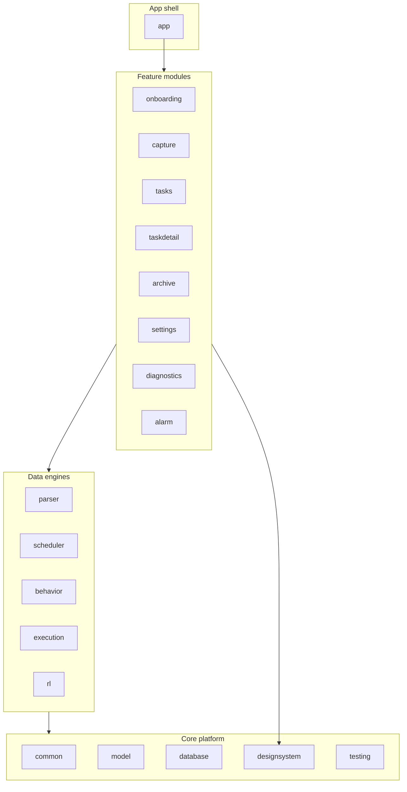
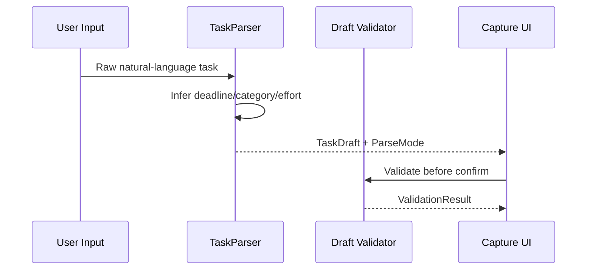

# ORKA Architecture

Deep engineering blueprint for ORKA's modular Android stack, execution runtime, and reliability pipeline.

---

## Table of contents

1. [Module graph](#1-module-graph)
2. [Data and state foundations](#2-data-and-state-foundations)
3. [On-device model pipeline (ADB-first)](#3-on-device-model-pipeline-adb-first)
4. [Parsing and draft generation](#4-parsing-and-draft-generation)
5. [Scheduling stack](#5-scheduling-stack)
6. [Alarm delivery and action surface](#6-alarm-delivery-and-action-surface)
7. [Diagnostics and OEM reliability](#7-diagnostics-and-oem-reliability)
8. [Testing strategy](#8-testing-strategy)
9. [Device matrix and operational posture](#9-device-matrix-and-operational-posture)

---

## 1. Module graph

ORKA is a strict multi-module Gradle project with downward dependency flow and UDF-oriented boundaries.

### Architectural invariants

- UI speaks through `ViewModel` + `StateFlow`.
- Feature modules do not reach across peer feature internals.
- Domain contracts live in `core:model`.
- Infra details remain in data/core modules.

---

## 2. Data and state foundations

### Room persistence

- Task, reminder, and interaction records persist in `core:database`.
- Schedulers and alarms are built around stable task/reminder identity.

### DataStore preferences

- `UserSettings` persists onboarding completion, scheduler toggles, and theme state.
- Model metadata surfaces through `ModelInstallState` from `ModelInstaller`.

### Runtime state model

- Parsing state: `ParseMode` (`GEMMA`, `FALLBACK`, `ERROR`)
- Diagnostics state: capability + model + scheduler readiness
- Scheduling state: rule/adaptive/RL mode selection

---

## 3. On-device model pipeline (ADB-first)

This repository targets **personal ADB installs**, not Play distribution. The model is
deliberately kept out of the APK: it's pushed to the device once via `adb push`, and app
builds stay lightweight regardless of how often the app itself is rebuilt/reinstalled.

### Device-side placement (no build-time packaging)

- Source of truth: `adb push gemma-4-E4B-it.litertlm /data/local/tmp/gemma-4-E4B-it.litertlm`,
  a one-time manual step per device — not a Gradle task, not an APK asset.
- `/data/local/tmp` is a world-readable location outside any app's private storage, so it
  survives app reinstalls/updates and isn't duplicated on-disk by the app.
- No `noCompress`/asset-packaging config needed since the model never enters the build.

### First-run detection

- `CompanionKitModelInstaller.installBundledModelIfAvailable()` checks, in order: (1) a prior
  `installFromCompanionKit` copy already in app-private storage, (2) the adb-pushed file at
  `/data/local/tmp`. The pushed file is used **directly** (no copy) — duplicating a multi-GB
  file into app storage would waste that much disk again for no benefit.
- `ModelInstallState` transitions to `READY` once either location is found, `NOT_INSTALLED`
  otherwise (with a message telling the user the exact `adb push` command to run).
- `DefaultTaskParser.parse()` re-runs this cheap detection (just `exists()`/`length()`, no I/O
  over the model bytes) on every parse call, so a model pushed after the app is already running
  is picked up on the next capture without needing a restart.
- Onboarding/settings expose status + a manual retry action, without requiring path entry.

### Inference pipeline

- Runs on `com.google.ai.edge.litertlm:litertlm-android`'s Kotlin `Engine`/`Conversation` API
  (successor to MediaPipe `LlmInference`, which is now maintenance-only and does not gain
  new capabilities).
- `GemmaEngineHolder` keeps one warm `Engine` for the process lifetime — `Engine.initialize()`
  can take up to ~10s, so it must not be rebuilt per parse call or per ViewModel instance.
- Runs on the CPU backend (`Backend.CPU()`) for reliability; GPU/NPU backends are available in
  the library but require additional native-library manifest entries and were not enabled here.
- `DefaultTaskParser.parse()` only attempts Gemma inference when the installed model file is
  above a minimum valid size threshold (10MB) — a corrupt/placeholder file transparently falls
  back to the regex parser instead of silently reporting `ParseMode.GEMMA` without ever loading
  a model.

### Backup stance

- Runtime model copy (`files/model`) remains excluded from backup and transfer rules
- Prevents oversized backup payloads and restore inconsistencies

---

## 4. Parsing and draft generation

`DefaultTaskParser` provides deterministic draft extraction and confidence hints.

### Parse-mode semantics

- `GEMMA`: model file is present and non-empty in app model storage
- `FALLBACK`: parser runs deterministic heuristics without model presence

> Current implementation focuses on deterministic reliability while keeping model-provisioning infrastructure production-ready.

---

## 5. Scheduling stack

ORKA orchestrates reminders through layered policies:

1. **Rule-based baseline**
   - deterministic schedule from deadline/effort context
2. **Adaptive mode**
   - behavior-profile adjustments when enough interaction signal exists
3. **RL mode**
   - enabled when trainer readiness reaches `Ready`

`SchedulerOrchestrator` chooses mode and persists resulting reminder timelines.

---

## 6. Alarm delivery and action surface

### Delivery path

- Exact alarms are registered via platform alarm services.
- Alarm UI is full-screen and action-driven (not passive notification-only).

### Action composition

Action surface is deterministic and bounded:

- start
- completion
- acknowledgement
- context action (snooze/reschedule/split)

This keeps runtime behavior predictable and testable under high urgency scenarios.

---

## 7. Diagnostics and OEM reliability

`DiagnosticsRepository` aggregates:

- exact alarm permission readiness
- notification availability
- battery optimization posture
- OEM action requirement
- model availability
- RL readiness and active scheduler mode

### OEM detection posture

OEM action-required handling includes:

- Xiaomi
- Realme
- OPPO
- OnePlus / OPlus

This powers onboarding and diagnostics guidance for aggressive process management environments.

---

## 8. Testing strategy

### Unit level

- JUnit4 + Truth + coroutines-test
- fake-first contracts via `core:testing`
- deterministic time/control with dispatcher rules

### Integration/instrumentation level

- Parser/installer behavior in android tests
- app flow coverage in compose instrumentation suites
- room DAO validation in `core:database` android tests

### Performance gates

- baseline profile module
- macrobenchmark module

---

## 9. Device matrix and operational posture

Given OEM power-management variance, ORKA validates behavior against mixed vendor policies.

| Vendor family | Risk profile | Operational expectation |
| --- | --- | --- |
| Pixel (AOSP-like) | Low | Standard exact-alarm + notification setup |
| Samsung (One UI) | Medium | Additional battery/deep-sleep allowlisting |
| OnePlus/OPlus (OxygenOS) | Medium-High | Background/auto-launch + unrestricted battery |
| Xiaomi/MIUI | High | OEM autostart/background allowances required |
| OPPO/Realme (ColorOS) | High | Aggressive kill mitigation via OEM settings |

---

Engineered for deterministic execution under real-world Android constraints.