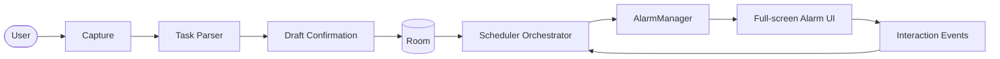

<!-- markdownlint-disable MD033 -->
<div align="center">

# 🚀 ORKA


**Execution, not intention.**

*An Android execution engine that turns intent into action using exact alarms, context-aware responses, and local-first intelligence.*


</div>
<!-- markdownlint-enable MD033 -->

---

## 🎯 Why ORKA

Most task apps remind you.
ORKA intervenes.

It combines:

- **Natural-language capture** for low-friction input.
- **Deterministic scheduling** with adaptive/RL pathways.
- **Full-screen exact alarms** for execution pressure at the right moment.
- **On-device model workflow** for private, local-first operation.

---

## ✨ Product highlights

### 🚨 Execution-first reminders

ORKA uses `AlarmManager`-driven exact alarms and an action surface designed for momentum:

- `START_TASK`
- `MARK_DONE`
- context-sensitive options (reschedule/snooze/split)
- acknowledgement trail for behavior profiling

### 🧠 On-device model (push once, build light)

The model is **not** bundled into the APK. Push `gemma-4-E4B-it.litertlm` to the device once via `adb push` (see Quick start below); ORKA detects it at that fixed path directly and runs inference through the LiteRT-LM Kotlin `Engine`/`Conversation` API (`com.google.ai.edge.litertlm:litertlm-android`) — no MediaPipe `LlmInference` dependency required.

- The model survives app reinstalls/updates — it's outside the app's own storage and outside the APK, so every subsequent `assembleDebug`/`installDebug` is a lightweight build.
- No manual model-path typing during onboarding; ORKA re-checks automatically.
- Fallback parsing remains available if the model isn't present or fails to load.

### 📱 OEM-aware reliability posture

ORKA includes setup guidance for aggressive OEM power policies (including OnePlus/OxygenOS) to reduce missed reminders in real-world conditions.

---

## 🗺️ System overview



---

## 🚀 Quick start (ADB-first)

### ✅ Prerequisites

- Android Studio (latest stable)
- JDK 17+
- Android device/emulator on API 31+
- `adb` available in your shell

### 🛠️ 1) Build and install the app

```bash
./gradlew :app:assembleDebug
./gradlew :app:installDebug
```

This APK does **not** contain the model, so it stays small and every rebuild/reinstall is fast.

### 📦 2) Push the model to the device — once

```bash
adb push gemma-4-E4B-it.litertlm /data/local/tmp/gemma-4-E4B-it.litertlm
```

You only need to do this once per device (it survives app reinstalls, since it lives outside
the app's own storage). If you rebuild/reinstall the app afterward, no re-push is needed.

### 🎬 3) First launch behavior

- ORKA detects the pushed model at `/data/local/tmp/gemma-4-E4B-it.litertlm` automatically.
- Onboarding/Settings show model status and a "Retry Model Provisioning" action if you push
  the file after the app is already running.

---

## 🧪 Testing & verification

```bash
# Full JVM test suite
./gradlew test

# App instrumentation tests (requires connected device/emulator)
./gradlew :app:connectedDebugAndroidTest

# Macrobenchmark & baseline profile modules
./gradlew :benchmark:assemble :baselineprofile:assemble
```

---

## 🔋 Device reliability checklist (OnePlus-focused)

For best reminder delivery on OnePlus/OxygenOS:

1. Allow exact alarms.
2. Set battery usage for ORKA to **Unrestricted**.
3. Enable background/auto-launch permissions in OEM security settings.
4. Keep notifications enabled.

---

## 📚 Documentation map

- Product and usage (this file): `README.md`
- Engineering blueprint: [`ARCHITECTURE.md`](./ARCHITECTURE.md)

---

## 🧾 Status notes

- Distribution target: **personal ADB installs**
- Play Store delivery: **out of scope** for this workflow
- Model source of truth: pushed once to `/data/local/tmp/gemma-4-E4B-it.litertlm` on-device (never bundled into the APK)

---

<!-- markdownlint-disable MD033 -->
<div align="center">

---

**⚡ ORKA: execution over intention.**

</div>
<!-- markdownlint-enable MD033 -->